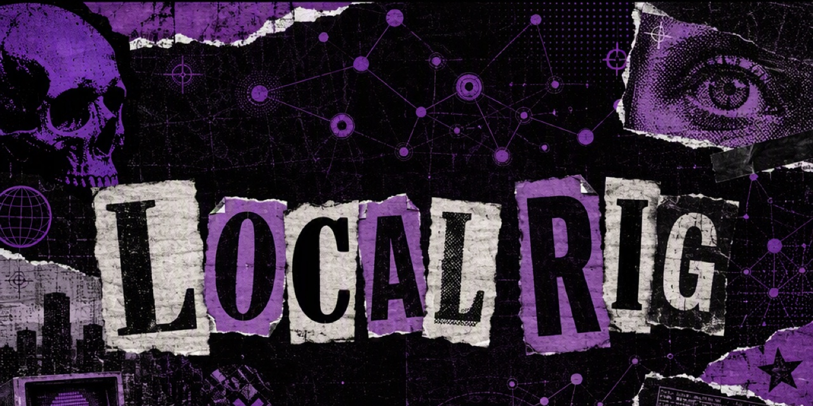

# Local Rig

A small native macOS dashboard for local development rigs, agent runtimes,
dev servers, MCP processes, emulators, and local models. Its first controller
adapter observes the existing `scripts/qa-rig.sh` and `scripts/rig2.sh`
contracts rather than replacing their process-safety rules.

## What it shows

- **Firebase Developer Suite:** A clear explanation of [Local Rigs & Firebase Emulators](docs/FIREBASE_EXPLAINER.md) for running multi-worktree frontends against shared or isolated emulators without port collisions.
- A developer Activity Monitor for Codex and Claude task cohorts, MCP servers,
  workspace Node processes, CPU, RAM, ports, age, and repository attribution
- Conservative stale-process candidates, with an attention-only filter and a
  redacted "Send review to agent" handoff
- Explicit cleanup for stale Codex cohorts: confirm first, re-scan live state,
  abort if an app-server returned, then send graceful `SIGTERM` to that cohort
  only; survivors are reported and never force-killed
- Bound dashboard and backend worktrees, current commits, holder, profile, and shared/isolated mode
- Dev server and Firebase emulator port truth
- Per-rig RAM estimates plus physical occupied/unused memory and macOS pressure
  status; the `memory_pressure` reserve score is not presented as free RAM
- A loopback-only llama.cpp service on `127.0.0.1:11435`, with official Muse
  Glimmer Dynamic/17 GB manifests, vision components, staged DFlash artifacts,
  conservative 16K/32K/64K contexts, verified Meta downloads, and Qwen support
- Tail views for `dev.log`, `emu.log`, and dashboard command output
- Allowlisted claim/start/stop/doctor/rebuild controls; existing-worktree binding is available through the agent MCP
- Redacted agent handoffs readable by Claude Code and Codex

## Run

```bash
./script/build_and_run.sh --verify
```

The Codex app Run action is wired to the same script.

Local builds use an ad-hoc signature by default and never ask for a keychain
password. A stable dedicated identity is optional: run
`script/setup_local_signing.sh` interactively, then build with
`LOCAL_RIG_SIGNING_MODE=dedicated`. macOS may request approval during that
one-time setup. Existing installations retain their bundle identifier during
the rename.

The signed runnable copy is installed at `~/Applications/Local Rig.app` and
launched from there. Build output remains under `dist/`; it is not launched
from the protected Documents tree.

## Install on another development Mac

Local Rig currently supports Apple silicon and macOS 14 or newer. Node.js 18+
is required for its MCP. From a checkout placed anywhere on the machine, run:

```bash
./script/install.sh --workspace /path/to/rheos-repos
```

The workspace must contain `scripts/rig2.sh` or `scripts/qa-rig.sh`. The
installer builds the app locally with the public `app.localrig.LocalRig`
identity, installs a stable MCP copy under `~/Library/Application Support`,
adds the project MCP plus `/rig` skill for Claude Code, adds the workspace
skill for Codex, registers the Codex MCP when the CLI is present, enables lean
mode, and opens the app. Run it with `--check` first to validate prerequisites
without changing anything.

Lean mode enables itself automatically on machines with 24 GB or less. It
hides local-model controls and reduces dashboard polling from eight to twelve
seconds. Rigs, dev servers, Firebase emulators, agent sessions, MCP memory,
logs, handoffs, and confirmed cleanup remain available.

The internal archive can be produced with:

```bash
./script/package_internal.sh
```

That archive is for local/internal validation. A public download requires an
Apple Developer ID signature, hardened-runtime validation, and notarization;
an ad-hoc signed archive should not be presented as a finished public release.

## Local models

The Local Models screen keeps inference separate from dev rigs and agent
sessions. Muse Glimmer currently runs as text-only or vision. The official
DFlash artifact is downloaded and retained, but accelerated/full modes are
hidden until llama.cpp resolves the official GGUF metadata crash tracked in
`ggml-org/llama.cpp#26894`. The 19.65 GB Dynamic model is intended for 32
GB-or-larger systems; the 16.76 GB variant is the 24 GB fallback. Local Rig
refuses a launch when the machine cannot satisfy the selected model's hardware
envelope or when macOS reports critical memory pressure. It never stops active
agents or rigs to make room. A loaded model sleeps after three idle minutes,
unloading its weights and KV cache while leaving the loopback API available;
the next inference request reloads it automatically.

## Agent-readable contract

The app writes generated, redacted state outside source code:

- `<rheos-repos>/.rig-dashboard/current.json`
- `<rheos-repos>/.rig-dashboard/handoffs/latest.md`
- Timestamped handoffs beside `latest.md`

Raw logs remain owned by the existing rig:

- legacy: `.qa-rig/dev.log`, `.qa-rig/emu.log`
- Rig 2: `.rig2/<n>/dev.log`, `.rig2/<n>/emu.log`

“Send to agent” writes a bounded redacted tail and copies a prompt containing
the artifact path. It does not silently invoke or spend quota in either agent.
The schema 8 runtime inventory excludes raw process command lines while retaining
the process ownership, resource, repository, and stale-review evidence an agent
needs to re-check the live machine safely.

## Codex and Claude connector

`mcp/` contains the `local-rig` tool-only MCP server. It exposes live rig state,
sanitized log tails, redacted handoff creation, claims, provisioning, safe
start/stop, doctor, and backend rebuild operations to Codex and Claude Code.
The portable installer writes the workspace `.mcp.json` registration for
Claude Code and installs a stable MCP copy outside the source checkout. Codex
uses that same launcher from its global MCP configuration. The workspace path
is passed explicitly, so neither connector depends on one developer's directory
layout or on keeping the Local Rig source checkout in a fixed location.

The connector intentionally omits reset, seed-save, repo repointing, arbitrary
shell commands, and all direct Firebase/Firestore access. See
`mcp/README.md` for its complete safety contract.

## Project adapters

Local Rig is the product name and runtime surface. The current controller
adapter still understands the Rheos repository layout and its Firebase
emulator contract. Those project-specific names identify monitored resources;
they are not part of the Local Rig brand. A future public release can add
other adapters without changing the app or MCP identity.

## Safety

- Ports are treated as liveness truth; PID files are only supporting metadata.
- Arbitrary shell commands are not accepted by the app.
- Stop actions delegate to the existing rig scripts, preserving their emulator
  PID protection.
- A verified `.rig2/VERIFIED` marker enables Rig 2 controls automatically. The
  Settings override exists only for bringing up an unverified controller.
- The app never starts a bare `next dev` process.
